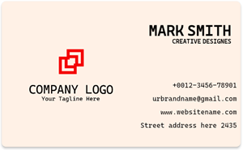

# Business Card Flutter Course Assignment
The task for this assignment was to recreate this card from this screenshot:

## Task Requirements:
The card must include the following components:
- Card
- InkWell

The card also needs to be responsive (to be able to scale down properly on smaller displays).

## The results:
This is my recreation of this card:

> I've even recreated the logo in Photoshop, since it was kinda blurry on the example image.